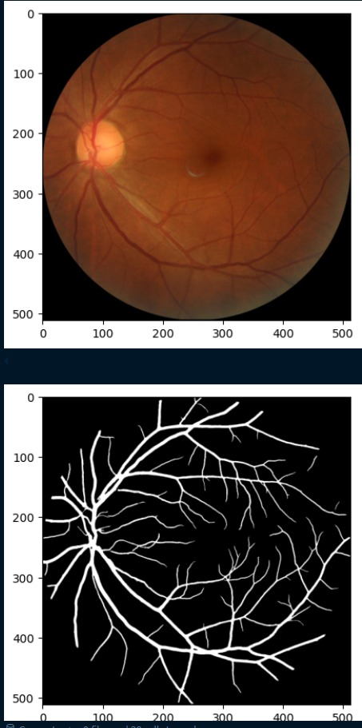
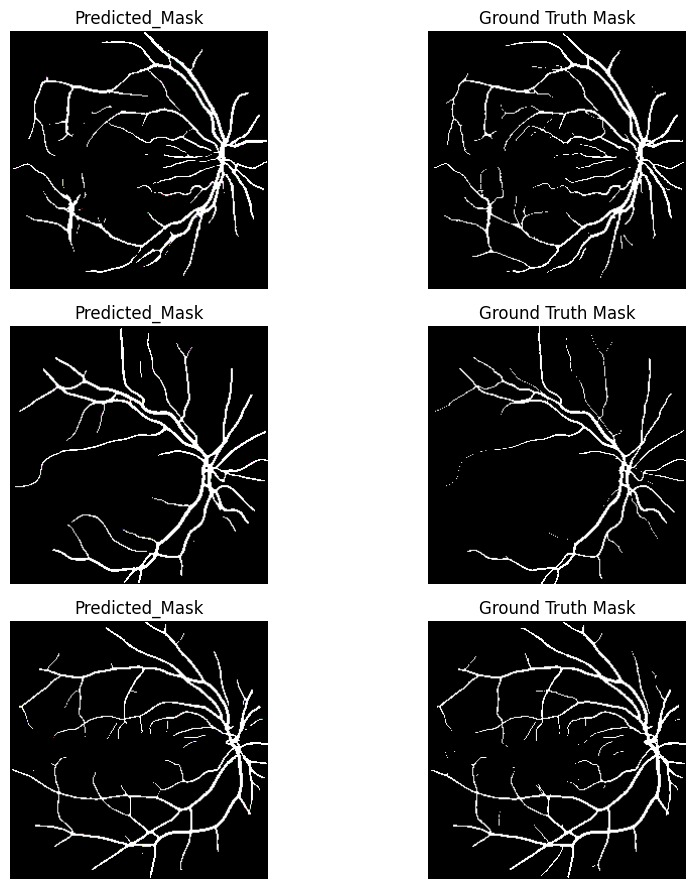

# **Retinal Blood Vessel Segmentation 🩺**

## **👁️ Overview**

This repository contains a deep-learning project focused on **retinal blood vessel segmentation** from fundus images. Accurate segmentation of blood vessels is crucial for the diagnosis and monitoring of various ocular diseases like **diabetic retinopathy, glaucoma, and hypertension**. This project leverages a modified U-Net architecture, the UNet+ model, with aggressive data augmentation techniques to achieve robust and precise segmentation.

## **💡 Problem Statement**

Retinal blood vessel segmentation is a fundamental step in the automated analysis of retinal images. The intricate and often low-contrast nature of these vessels makes manual segmentation tedious and prone to human error. An automated, accurate, and efficient method is essential for:

* Early detection of retinal pathologies. 🔍  
* Quantitative analysis of vessel morphology (e.g., tortuosity, width). 📏  
* Reducing the burden on ophthalmologists. 👩‍⚕️

## **📊 Dataset**

This project utilizes the [SMDG, A Standardized Fundus Glaucoma Dataset](https://www.kaggle.com/datasets/deathtrooper/multichannel-glaucoma-benchmark-dataset) (specifically, the full-fundus and blood-vessel subsets (462 samples)) available on Kaggle.

## **🚀 Methodology**

The core of this project involves training a deep encoder-decoder architecture, the **UNet+ model** (with Pixel Shuffling upsampling implemented), to perform pixel-wise classification of blood vessels, assisted by Dice Loss and BCE loss.

## **⚙️ Setup and Installation**

To set up the environment and run the notebook, follow these steps:

1. **Clone the repository:**  
   git clone https://github.com/your\_username/retinal-blood-vessel-segmentation.git  
   cd retinal-blood-vessel-segmentation

2. **Install dependencies**:  
   It's recommended to use a virtual environment before you install any dependencies.

## **🏃 Usage**

1. **Open the Jupyter Notebook:**  
   jupyter notebook retinal-blood-vessel-segmentation.ipynb

2. Run all cells:  
   Execute the cells sequentially to:  
   * Install necessary modules (torchmetrics). ✅  
   * Import libraries. 📚  
   * Define data preprocessing and augmentation transforms. ⚙️  
   * Define the custom RBVD Dataset class. 🧑‍💻  
   * Load image and mask paths. ➡️  
   * Visualize example image-mask pairs. 🖼️  
   * **Training Loop:** Run the training process, including the loss function (e.g., Dice \+ BCE Loss), optimizer, and epochs. 🏋️  
   * **Evaluation:** Evaluate through the metrics (e.g., IoU, Pixel-Wise Accuracy, F1-score) and evaluate the model's performance on a validation set. 📈  
   * **Prediction and Visualization:** Generate and visualize segmentation masks on new images. 🌟

## **📈 Results**
**Example Visualizations:**

**Quantitative Metrics: (Based on Unseen Test Data Set)**

| Metric | Value |
| :---- | :---- |
| IoU | .806 |
| Pixel-Wise Accuracy | 98.38% |
| Recall | .904 |
| Precision | .881 |
| F1 Score | .837 |

## **🚀 Future Work & Improvements**

* **Model Optimization:** Experiment with different U-Net variations (e.g., attention U-Net, residual U-Net) or other segmentation architectures. 💡  
* **Hyperparameter Tuning:** Optimize learning rate, batch size, and other training parameters. ⚙️  
* **Advanced Augmentation:** Explore more sophisticated data augmentation techniques (e.g., elastic deformations). ✨  
* **Loss Functions:** Investigate different loss functions or combinations suitable for segmentation (e.g., Tversky Loss, Focal Loss). 📉  
* **Cross-Validation:** Implement k-fold cross-validation for a more robust evaluation. ✅  
* **Deployment:** Explore deploying the trained model as a web service or desktop application. 🌐  
* **Additional Datasets:** Test the model's generalization on other publicly available retinal image datasets (e.g., DRIVE, STARE). 📚

## **🤝 Contributing**

Contributions are welcome\! If you have suggestions for improvements, new features, or bug fixes, please feel free to:

1. Fork the repository. 🍴  
2. Create a new branch (git checkout \-b feature/YourFeature). 🌳  
3. Make your changes. ✏️  
4. Commit your changes (git commit \-m 'Add YourFeature'). 💾  
5. Push to the branch (git push origin feature/YourFeature). ⬆️  
6. Open a Pull Request. ➡️

## **📄 License**

This project is licensed under the MIT License \- see the LICENSE file for details. 📜

## **🙏 Developer Contact**

Develope*r:* **Souradeep Dutta**,

Email:  **aimldatasets22@gmail.com**